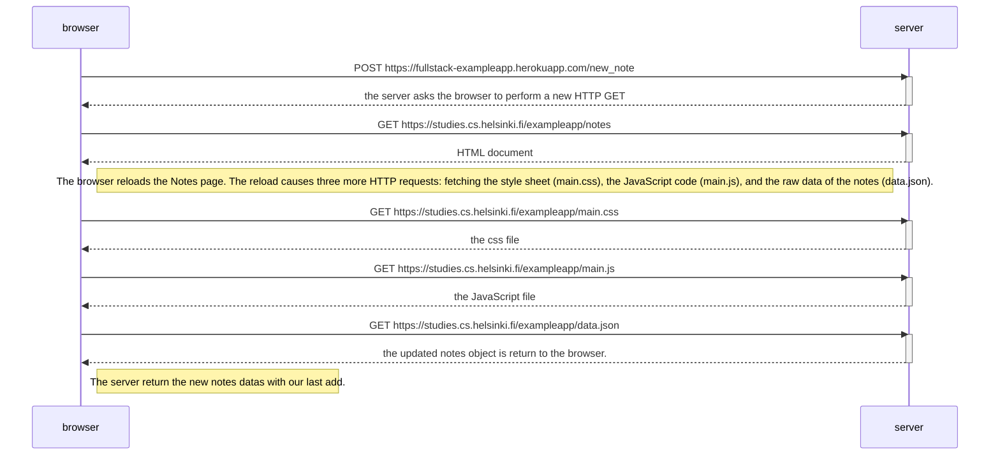

```mermaid
    sequenceDiagram
        participant browser
        participant server

        browser->>server: POST https://fullstack-exampleapp.herokuapp.com/new_note
        activate server
        server-->>browser: the server asks the browser to perform a new HTTP GET
        deactivate server
    
        browser->>server: GET https://studies.cs.helsinki.fi/exampleapp/notes
        activate server
        server-->>browser: HTML document
        deactivate server
    
        Note right of browser: The browser reloads the Notes page. The reload causes three more HTTP requests: fetching the style sheet (main.css), the JavaScript code (main.js), and the raw data of the notes (data.json).
    
        browser->>server: GET https://studies.cs.helsinki.fi/exampleapp/main.css
        activate server
        server-->>browser: the css file
        deactivate server
    
        browser->>server: GET https://studies.cs.helsinki.fi/exampleapp/main.js
        activate server
        server-->>browser: the JavaScript file
        deactivate server
    
        browser->>server: GET https://studies.cs.helsinki.fi/exampleapp/data.json
        activate server
        server-->>browser: the updated notes object is return to the browser.
        deactivate server

        Note right of browser: The server return the new notes datas with our last add.
```
