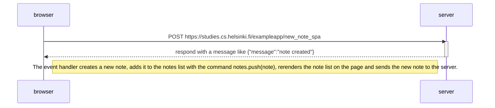

```mermaid
    sequenceDiagram
        participant browser
        participant server

        browser->>server: POST https://studies.cs.helsinki.fi/exampleapp/new_note_spa
        activate server
        server-->>browser: respond with a message like {"message":"note created"}
        deactivate server

    
        Note right of browser: The event handler creates a new note, adds it to the notes list with the command notes.push(note), rerenders the note list on the page and sends the new note to the server.
    
```
